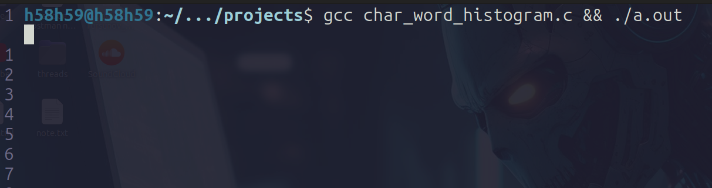
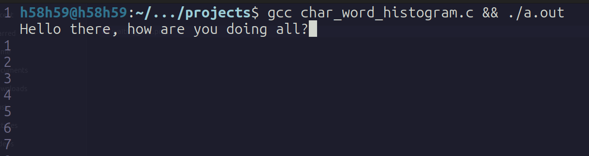
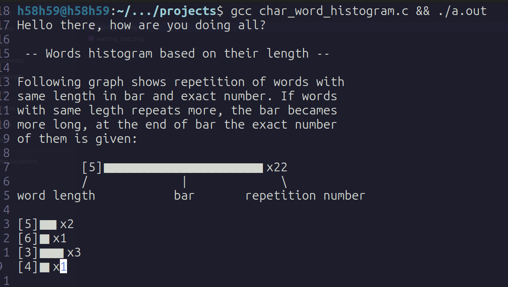
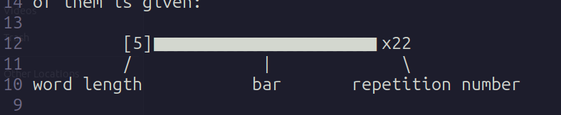
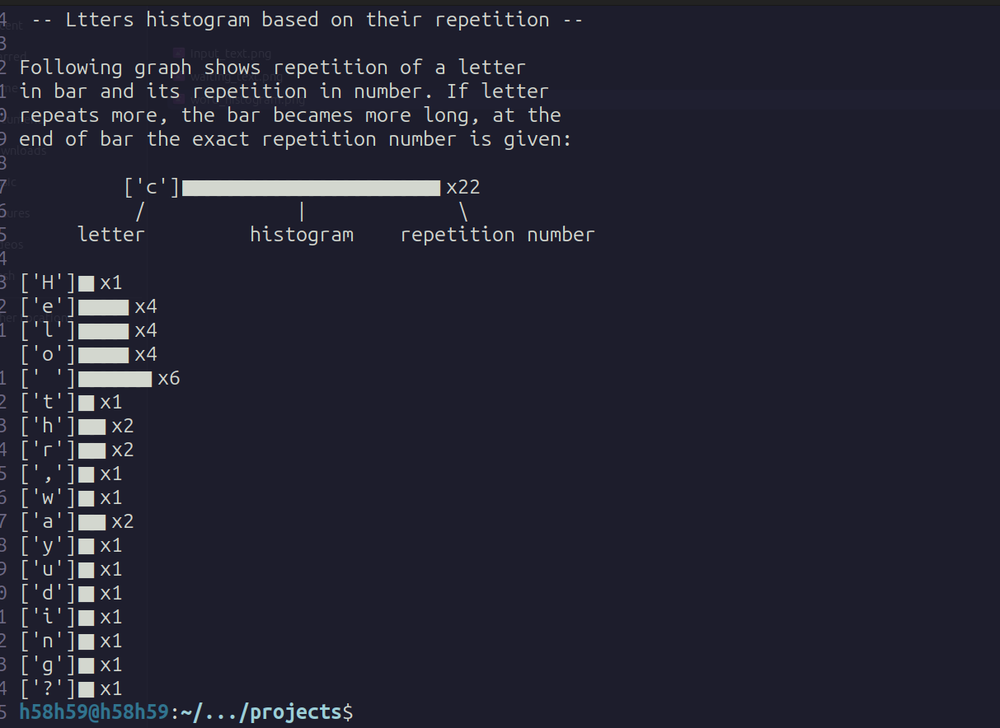

# Word and letter histogram application in C language

This application generates words and letters histogram in illustrative way.

It gives the number of words with the same length and number of a letter's repetition.

***If you want you can watch the walk through video of this project [here](https://youtu.be/iJPT7CF-SWU).***

[see the code](https://github.com/AbdulxaqDev/c-learn/blob/main/the_c_prog_lang/projects/char_word_histogram.c)

## To run this application you need

C and C++ Compilers [gcc](https://www.freecodecamp.org/news/what-is-a-compiler-in-c/) to run c code.

[How to Install C and C++ Compilers on Windows](https://www.freecodecamp.org/news/how-to-install-c-and-cpp-compiler-on-windows/)

[How to Install C and C++ Compilers on Linux](https://linuxconfig.org/how-to-install-g-the-c-compiler-on-ubuntu-18-04-bionic-beaver-linux)

## Usage

It will promt you text input in terminal. You can past any text or you can type it in terminal.
As you can see, I run the application and it is waiting for text input:

I typed sample text:

I pressed <kbd>Ctrl</kbd>+<kbd>D</kbd> twice (if you are in Windows, press <kbd>Ctrl</kbd>+<kbd>Z</kbd>).

And, here are the results:

This histogram is saying that the input text containes two words with the length of 5, a word with the length of 6 and so on.

Here explanation of histogram:

At the beginning, it is showing the leng of word in squar brackets [5], the bar length tells the most repeated one. At the end, the exact number of words with same length in sample text.

Here is the similar result for letters:

Here we see can the letters repetition on above histogram. For example, "H" letter came once and "e" letter came four times in sample text.

If you want you can watch the walk through video of this project [here](https://youtu.be/iJPT7CF-SWU).

